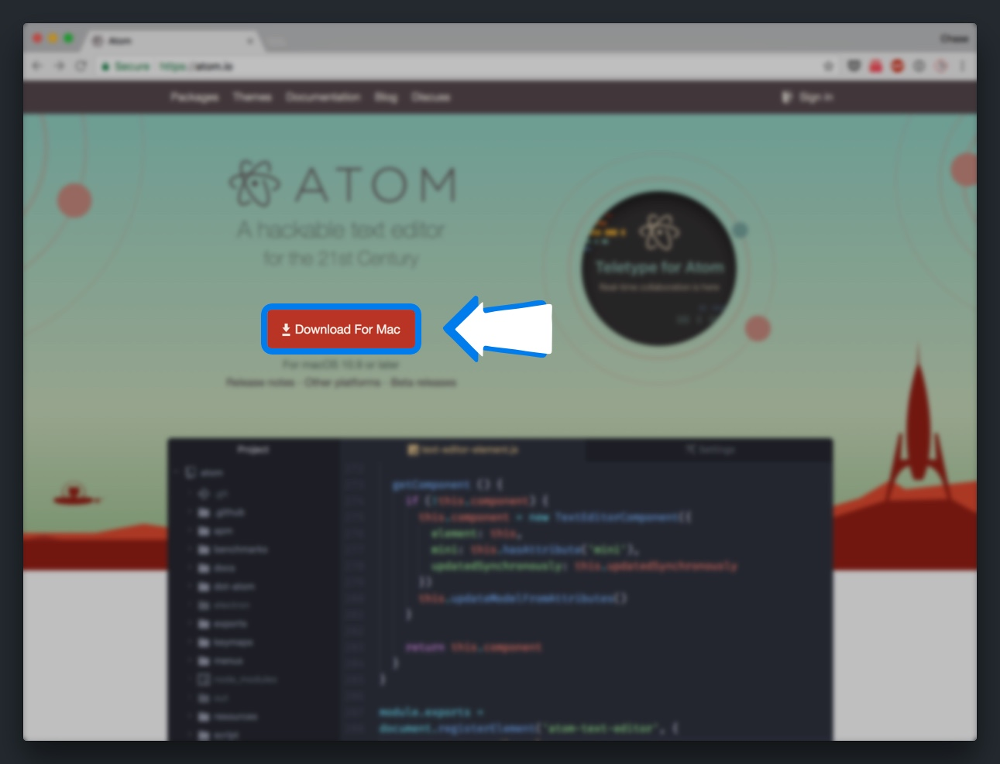
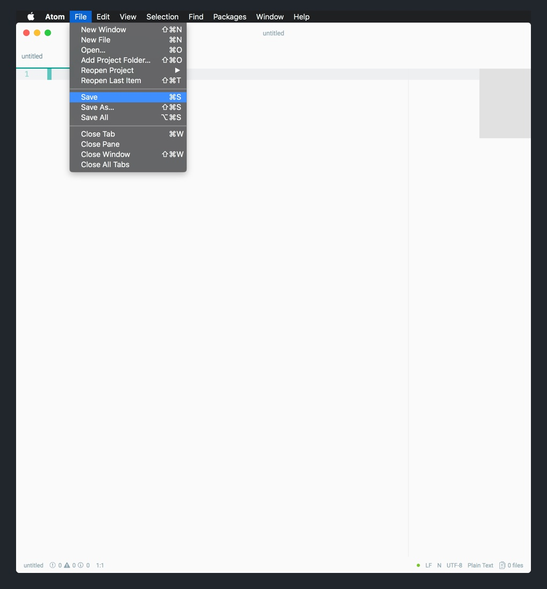
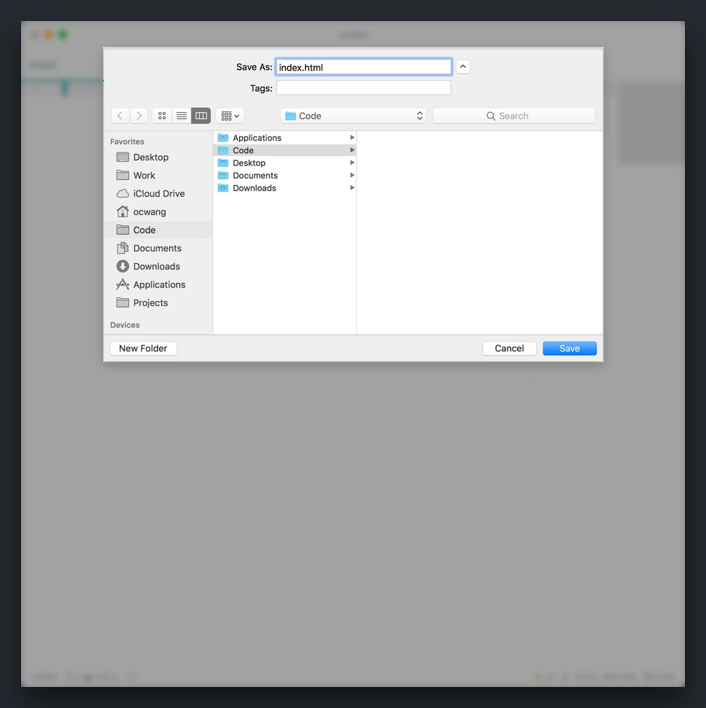
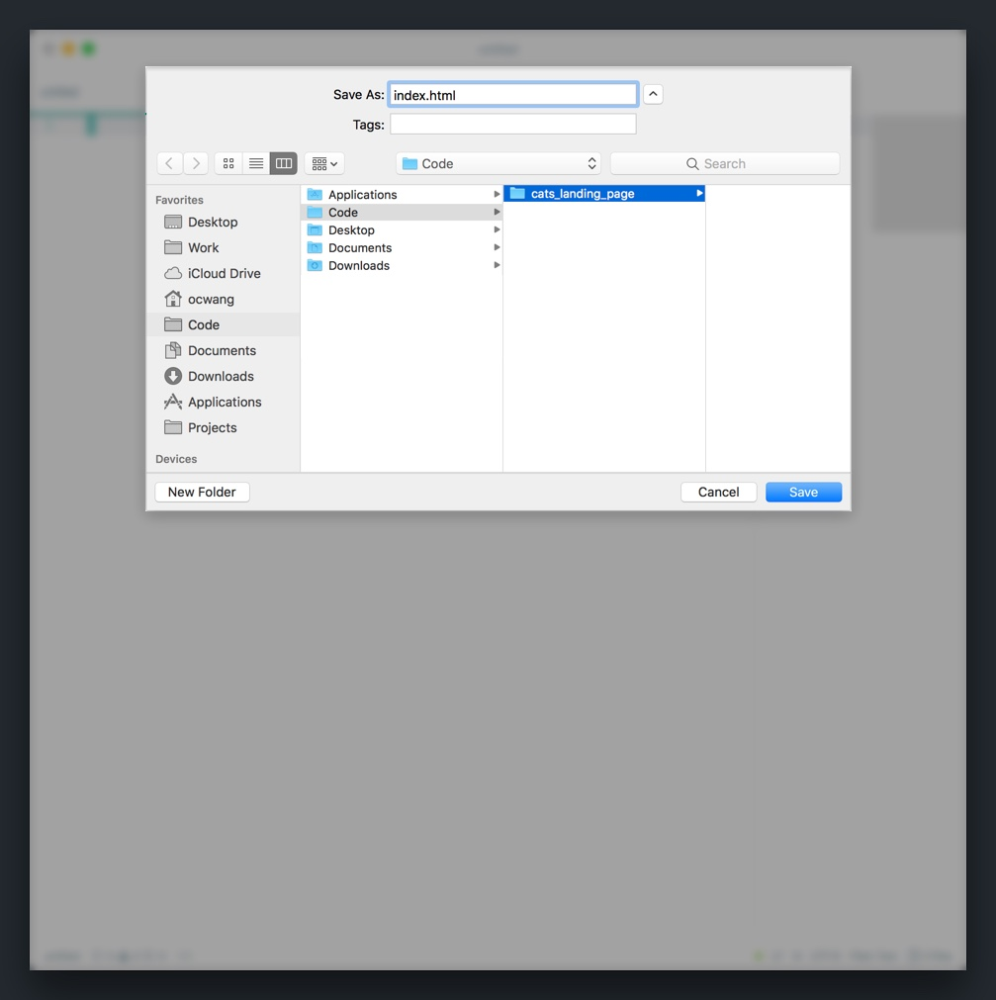
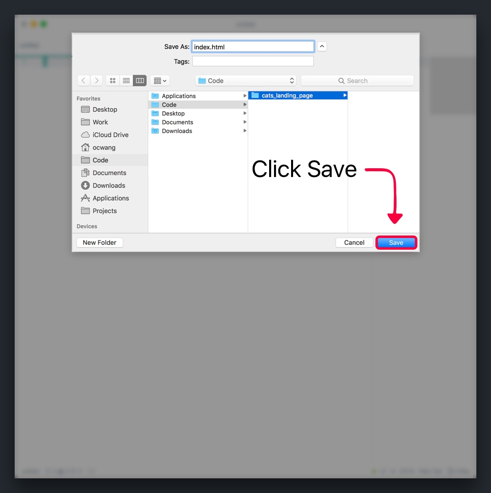

Before we start building, we'll need to start by setting up our developer environment.

<!-- TODO: maybe review this definition -->

> [info]
>
A _developer (dev) environment_ refers to the tools and initial setup a developer needs to start coding whatever they're building.

For us, we'll keep things simple and only focus on the tools we'll immediately need to start writing front-end code for our landing page.

The two tools we'll need to have installed are [_Google Chrome_](https://www.google.com/chrome/) and the [_Atom_](https://atom.io) text editor. 

# Installing Google Chrome

You're probably familiar with the web browser. In fact, right now, you're viewing this tutorial through a web browser.

A browser allows you to view websites on the internet, but it'll also allow us to view, test and interact with the code we're going to write.

## Why Chrome?

Google Chrome is a popular choice for many web developers. Not only is it available on every major platform, it also has a whoppin' 58.9% market share. That means roughly 60% of users will visit your website through a Chrome browser, with Firefox trailing in second place at 13.3%.

You might not know this, but each different web browser (Chrome, Firefox, Safari) will display the code of a website a little differently. We want to use Chrome as we test and develop because it'll allow us to make sure the wide majority (holy 60%!) have a good user experience.

> [info]
What is does *user experience* mean?
>
In product development, the term user experience, or UX, is used to describe how a user feels after interacting with a product or service. When you start building, try to keep your users in mind and think about how they'll feel when using your web apps.

Another reason many developers prefer Chrome is because of _Chrome Developer Tools_. Dev tools, as the name implies, are tools for developers. They allow us to view, test and interact with our code in the Chrome browser. Google has invested a lot of time and resources into creating their dev tools. We'll learn more about them in the section _Chrome Developer Tools_.

## Downloading Chrome

> [info]
If you've already installed Chrome on your computer, make sure it's updated to the latest version before continuing onto the next section, _How The Internet Works_.

To download Google Chrome, find your operating system and follow the corresponding set of instructions below:

### Install Chrome on Windows
1. Download the [installation file.](https://www.google.com/chrome/)
1. If prompted, click *Run* or *Save*.
1. If you chose *Save*, double-click the download to start installing. 
1. Start Chrome:
  - *Windows 7:* A Chrome window opens once everything is done.
  - *Windows 8 and 8.1:* A welcome dialogue appears. Click Next to select your default browser.
  - *Windows 10:* A Chrome window opens once everything is done.

### Install Chrome on Mac
1. Download the [installation file.](https://www.google.com/chrome/)
1. Open the file called 'googlechrome.dmg'.
1. In the window that opens, find Chrome.
1. Drag Chrome to the Applications folder.
  - You might be asked to enter the admin password.
  - If you don't know the admin password, drag Chrome to a place on your computer where you can make edits, like your desktop.
1. Open Chrome.
1. Open Finder.
1. In the sidebar, to the right of Google Chrome, click Eject.

### Install Chrome on Linux
1. Download the [installation file.](https://www.google.com/chrome/)
1. To open the package, click *OK*.
1. Click *Install Package*.

For reference, you can find the documentation [here](https://support.google.com/chrome/answer/95346).

After successfully downloading Google Chrome, open it. 

You should see the 'New Tab' that looks like the following:

With Chrome installed, let's quickly install [_Atom_](https://atom.io) so we can get started building.

# About Atom

Atom is a popular, open-source text editor that was created by [Github](https://github.com/). We'll use Atom to write and edit the code for our landing page.

Atom is an excellent text editor for beginners and experts alike because of it's design and ease of use. This allows developers to spend more time on coding instead of configuring their text editor.

> [info]
>
If you've already installed and are comfortable with another text editor, feel free to use your text editor of choice instead. What's **most** important is that you feel comfortable and productive when coding.

## Installing Atom

Installing Atom is easy enough. Follow the instructions below:

> [action]
Install Atom by doing the following:
>
1. Go to Atom's landing page by clicking [here](https://atom.io/).
1. On the landing page, find the CTA button to download the text editor.
>

<!-- TODO: (optional) add section to install some key packages and theming -->

## Getting Started with Atom

After downloading and installing Atom, go ahead and open your new text editor.

> [action]
Open the Atom text editor. You should see the following:
>

>
Depending on your UI/Syntax theme and the packages you have installed, you editor may look differently.

Next, let's save our new _untitled_ file in the right place.

> [action]
Before saving, make sure you read and follow all the steps below:
>
1. Save the _untitled_ file by pressing the shortcut `CMD-s` or selecting the _Save_ command in the _File menu_. 
1. In the prompt, save with the file name `index.html`. It's important to include the extension `.html`. 
1. Find a easy-to-find file path (i.e. `~/Code/html/`) on your computer to save all the files for your soon-to-be landing page. Make sure you create a new folder called `cats_landing_page` to contain any additional files that we add later. 
1. Click the `Save` button to finish creating your new `index.html` file. 

With _Atom_ installed and our new `index.html` file created, let's begin learning about HTML and how to build the content for our landing page.
