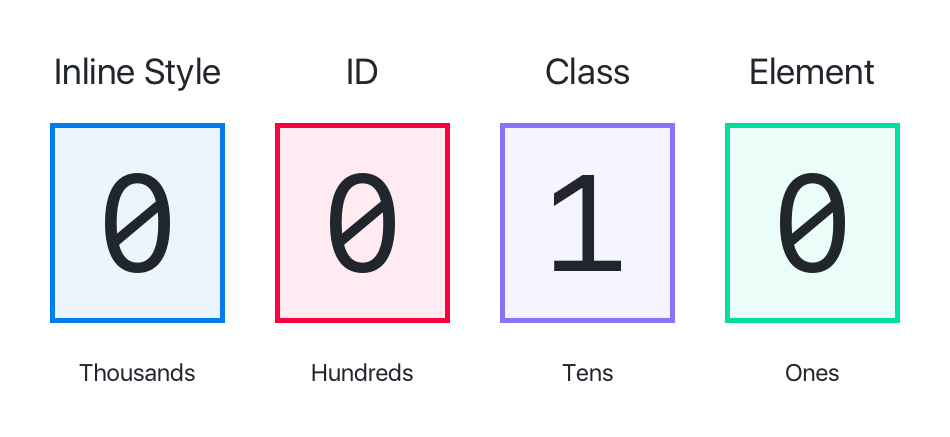
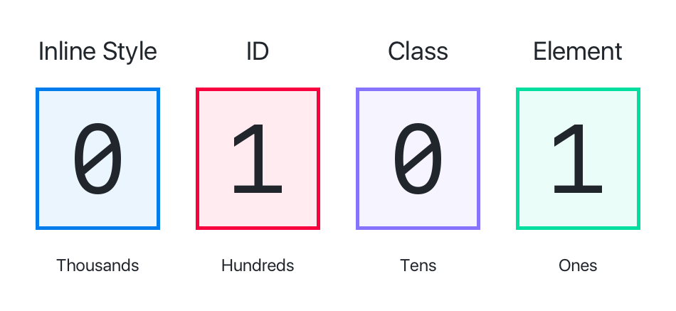

Before our landing page can really start coming together, we'll need to learn a little more about CSS. In this section, we'll be adding CSS specificity, the _descendant selector** and CSS inheritance into our arsenel.

# The Descendant Selector

So far, we've learned about class, id and element selectors and how to use them to target HTML elements respectively. Next, we'll cover another common selector that will allow us to target specific HTML elements within a container element.

The **descendant selector** allows us to target HTML elements that are a child element (hence the name descendant) of a parent element. This usually occurs within container elements such as <div>, <header>, etc.

The structure for the descendant selector is as follows:

```
parent-selector descendant-selector {
  /* ... insert declarations here */
}
```

Notice the parent selector and the descendant selector are separated by a space ` `. For example, perhaps we want to make all <p> elements in our <header> have a font color of `blue`. We could write the following:

```
header p {
  color: blue;
  font-size: 20px;
}
```

In our example above, <header> is the container element and our descendant selector targets all <p> elements within <header>.

The parent selector can also be a class selector. For example, take the following HTML:

```
<div class="example-div">
  <h1>Section Heading</h1>
  
</div>
```

If we wanted to select the  element, we could use the following selector:

```
.example-div img {
  /* ... insert declarations here */
}
```

Notice how we use the `.example-div` class to select the <div> container, before adding the  descendant selector.

Using descendant selectors can be especially useful for applying CSS rules to a subgroup of children elements. Let's put this into action.

Currently in our `style.css`, we have the current two CSS rules:

```
ul {
  background-color: #F7F9FC;
  border-radius: 8px;
  margin-top: 25px;
  padding: 30px 55px;
}

li {
  margin-bottom: 8px;
}
```

We don't want these declarations to be applied to all unordered list and list item elements, just the element within our first section. We can use a descendant selector to implement our desired behavior.

> [challenge]
>
Modify the existing CSS rule above to target only unordered list and list items within the first section.

<!-- break -->

> [solution]
>
You can modify the existing CSS rule to use the `.first-section` class to target all <ul> and <li> elements within the `.first-section` container element:
>
```
.first-section ul {
  background-color: #F7F9FC;
  border-radius: 8px;
  margin-top: 25px;
  padding: 30px 55px;
}
>
.first-section li {
  margin-bottom: 8px;
}
```

You can see how this selector is useful for selecting HTML elements within a container element. We'll keep this new selector handy as we start implementing more of our landing page's sections.

> [info]
>
If you're interested in learning about other selectors that are available, you can [click here](https://code.tutsplus.com/tutorials/the-30-css-selectors-you-must-memorize--net-16048) for reference. Many of these selectors are less common and you may not ever use them in your own code. Nonetheless, it's good to have the knowledge of what's possible with CSS selectors. And no, you don't need to memorize all of these selectors.

# CSS Specificity

By creating CSS selectors that are more specific, another problem arises. What happens when multiple CSS rules apply to the same HTML element?

Enter CSS specificity. CSS specificity is a measure of how specific the selector of a CSS rule is. The selector with the highest specificity _wins_ and is applied to the HTML element over other less specific ones.

For example, given the following HTML and CSS, which rule is applied?

```
<!-- HTML -->
<div class="outer">
  <p id="p-element">This is a paragraph element.</p>
</div>

<!-- CSS -->
.outer p {
  color: red;
}

#p-element {
  color: blue;
}
```

To figure this out, we'll need to learn about how the browser calculates CSS specificity.

## How to Calculate Specificity

CSS applies different weights to different selectors. Each weight is a magnitude higher than the other.

[CSS Specificity Magnitudes](assets/css_specificity_magnitudes.png)

> [info]
>
We've included the _inline style_ value for completeness but as we've previously covered, writing CSS inline (in your HTML doc) is bad practice and will lead to messy, unmaintainable code.

To calculate the specificity value (which selector will be applied), we simply look at the selector and add a value of 100 for every id selector, add 10 for every class selector and add 1 for every element selector.

As you can see, each type of selector is weighted a magnitude higher than the previous one. Let's look at some examples:

> [challenge]
>
What is the specificity value of the following selector: `.blue`.

<!-- break -->

> [solution]
>
If we calculate the specificity for the selector `.blue`, we'll get the following:
>

>
The specificity value is 0,0,1,0.

> [challenge]
>
What is the specificity value of the selector: `header #sign-up-btn`?

<!-- break -->

> [solution]
>
Breaking apart `header #sign-up-btn`, header is an element, so we add a value of 1. The descendant selector is an id of `#sign-up-btn` which has a value of 100. In total, our specificity value is 0,1,0,1.
>


Now that we have a general idea of how to calculate CSS specificity, let's try again with our initial example.

> [challenge]
>
Given the following HTML and CSS, what color will the paragraph text be when displayed by the browser? What is the specificity value of each selector?
>
```
<!-- HTML -->
<div class="outer">
  <p id="p-element">This is a paragraph element.</p>
</div>

<!-- CSS -->
.outer p {
  color: red;
}

#p-element {
  color: blue;
}
```

<!-- break -->

> [solution]
>
Because id selectors are a magnitude greater than class and element selectors, the color of the paragraph text would be `blue`.
>
The specificity value for `.outer p` would be 0,0,1,1 where the specificity value of `#p-element` would be 0,1,0,0.

<!-- break -->

> [info]
>
It's also possible to override specificity score by adding an `!important` after the value of a CSS declaration. However, generally this is considered bad practice as you're no longer using CSS specificity making your stylesheet less maintainable.

CSS specificity will be important to keep in mind as your stylesheets start getting bigger and bigger. When multiple rules apply to the same HTML element, you'll be able to understand which rule takes precedence.

<!-- TODO: add note that your CSS combinations shouldn't be that long for maintainablitiy -->

# CSS Inheritance

Another property of CSS is referred to as CSS inheritance. Inheritance refers to the property that certain CSS properties are automatically inherited by an element's children.

> [info]
>
An element's children refers to the elements that are contained within another container element, such as the <div>, <header> or even <body> tags.

CSS inheritance allows us to set the property of a container element and have that property trickle down to be applied to each child element. This prevents us having to redefine the same declaration, over and over again for multiple child elements.

Examples of properties that are inherited include: `font-family`, `color` and `text-align`. It's **important** to note, that most properties are **not** inherited.

Let's take a look:

> [challenge]
>
In your stylesheet, create a new CSS rule that selects the body element and gives it a _color_ of `red`.

<!-- break -->

> [solution]
>
In `style.css`:
>
```
body {
  color: red;
}
```

Refresh your landing page and you'll notice that our <p> text is now all red. But why aren't our section headings red? You got it–CSS specificity. For both our <h1> and <h2> element, there's a more specific rule applying the `color` property that has a higher specificity value.

But for our final designs, we don't actually want our <p> text color to be `red`. We only used `red` to make the effects of CSS inheritance obvious. Applying a color of `red` to our `body` selector applied the `red` color to all of our text that didn't have a more specific CSS rule. This can be useful for implementing default properties for groups of HTML elements.

Let's modify the default color value to it's intended value.

> [challenge]
>
Modify your CSS rule to apply a `color` of the hex value `#4a4a4a`. This value will be inherited by the rest of your text by default.

<!-- break -->

> [solution]
>
Your modified CSS rule should look like:
>
```
body {
  color: #4a4a4a;
}
```

# Up Next

We've covered a few more key CSS concepts that will help us write cleaner, more re-usable CSS. In additional, we'll be able to understand CSS and how it behaves from the examples of other developers.

Up next, we'll dive into a popular CSS framework named _Bootstrap_. Using _Bootstrap_, we'll be able to quickly style and layout our HTML content with pre-made stylesheets.
