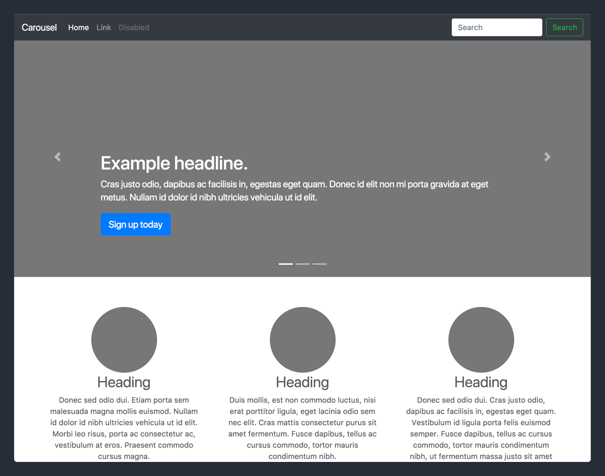
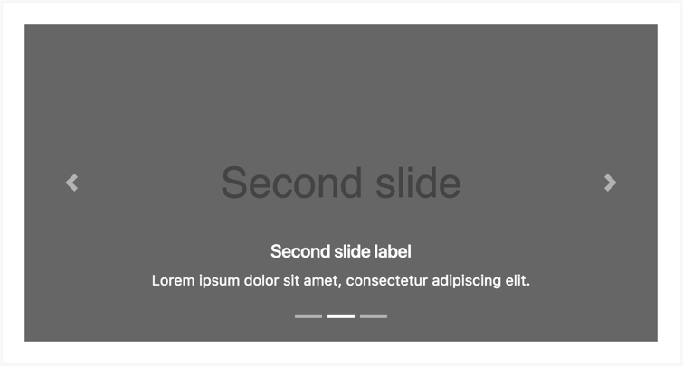
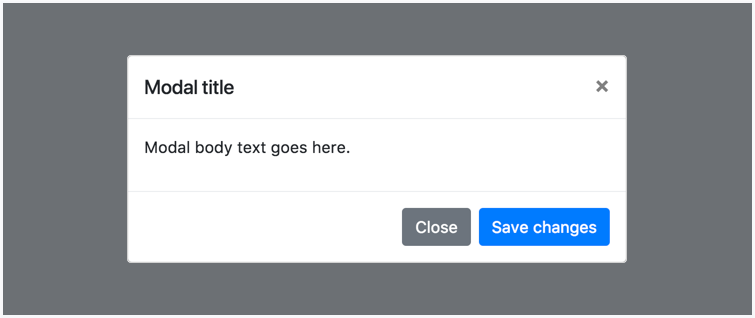
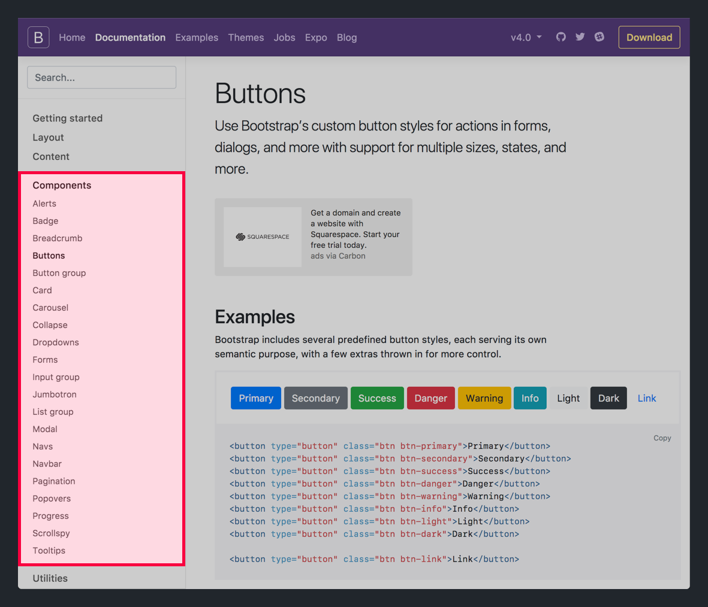
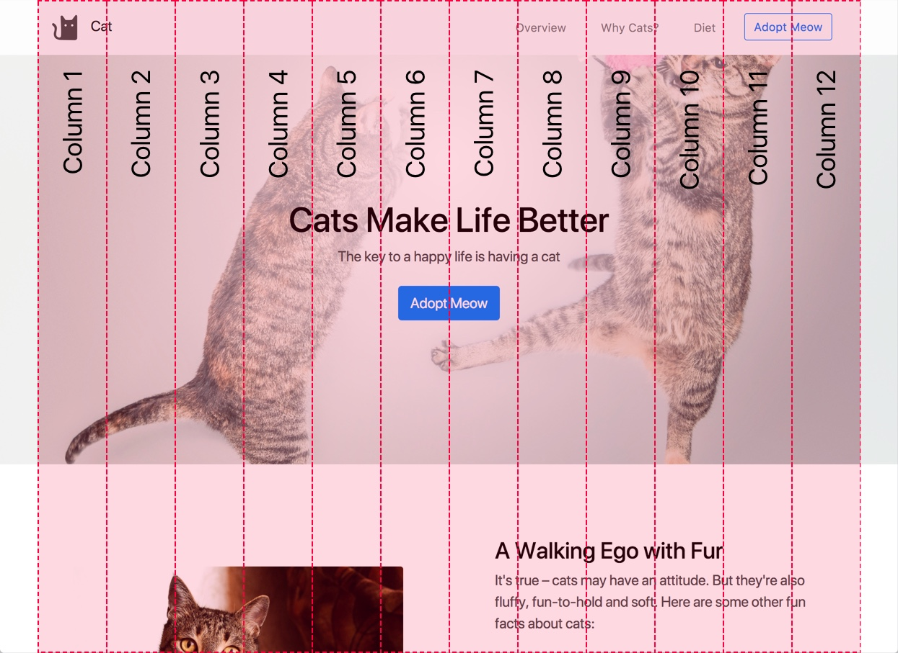
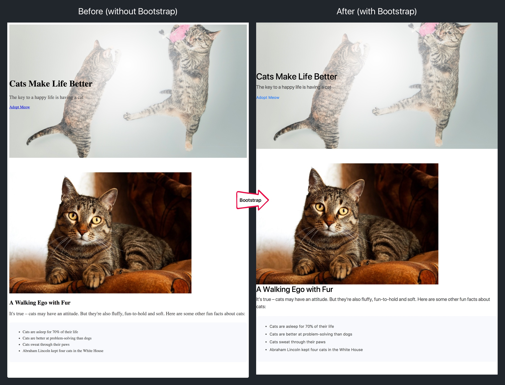
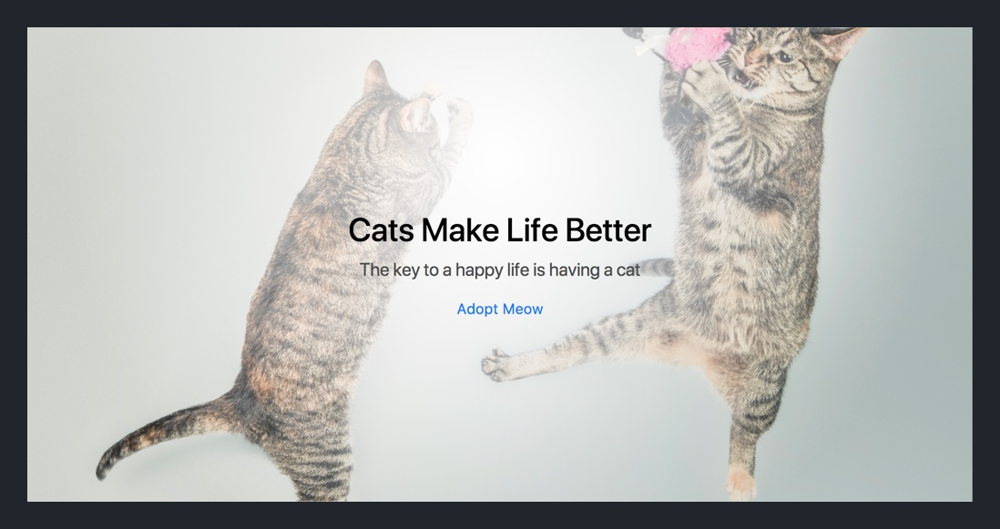
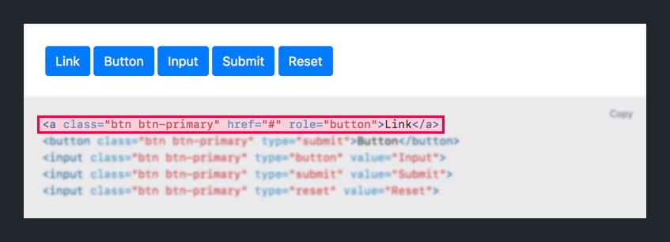

As developers, it's common to use resources and frameworks built by other developers. This allows us to save time whenever we start new projects because we don't need to code everything from scratch.

In this section, we'll learn about a popular front-end framework named _Bootstrap._ Throughout the rest of this tutorial, and any of our new projects, we'll use _Bootstrap_ to quickly style and layout our HTML elements.

# What is Bootstrap?

_Bootstrap_ is a front-end frameworks made up of pre-written HTML, CSS and JavaScript code. Using the [Bootstrap Documentation](https://getbootstrap.com/docs/4.0/getting-started/introduction/), we can utilize the framework's many tools to quickly layout our HTML content, stylize our HTML elements and/or use _Bootstrap's_ pre-built HTML components.



> [info]
>
If you're interested in checking out more examples of popular HTML layouts buit with _Bootstrap_, you can [click here.](https://getbootstrap.com/docs/4.0/examples/)

But what does this mean for us?

Instead of needing to write a bunch of the same HTML, CSS and JavaScript each time we create a new project, we can utilize _Bootstrap_ to do a lot work for us. In this tutorial, we'll learn about the following: _Bootstrap's_ CSS, pre-built components and it's grid system.

### Bootstrap CSS

The majority of _Bootstrap_ is made up of pre-built CSS stylesheets that allow developers to quickly style their HTML elements. After we install _Bootstrap_, we can simply add any of their CSS classes in our element to configure our HTML content.

### Pre-built Components

In addition to CSS classes, the _Bootstrap_ framework includes components made from HTML, CSS and occasionally JavaScript. These components are especially useful for quickly adding well-designed HTML components into your projects.

Some examples include:

- A navbar at the top of your landing page that collapses on mobile devices 
- A carousel that acts as a slideshow for multiple different images and text 
- Modal popups that display alerts or notifications 

To implement a component, you can look through the [Bootstrap documentation](https://getbootstrap.com/docs/4.0/components/) and find the HTML code for each component in the side bar:



### Grid System

One of the most defining features of _Bootstrap_ is it's grid system. Bootstrap's grid system allows you to easily position and layout HTML content using a 12 column grid.



We'll spend the entire next section learning about Bootstrap's grid system and how to use it.

# Installing Bootstrap

Before we can use Bootstrap, we'll need to do some setup in our HTML document. First, we'll need to add an additional CSS stylesheet that contains all of Bootstrap's CSS.

> [action]
>
In `index.html`, modify your `<head>` element to the following:
>
```
<head>
  <meta charset="utf-8">
  // 1
  <meta name="viewport" content="width=device-width, initial-scale=1, shrink-to-fit=no">
  <title>Cats – The Internet's Favorite Animal</title>
>
  // 2
  <link rel="stylesheet" href="https://maxcdn.bootstrapcdn.com/bootstrap/4.0.0/css/bootstrap.min.css" integrity="sha384-Gn5384xqQ1aoWXA+058RXPxPg6fy4IWvTNh0E263XmFcJlSAwiGgFAW/dAiS6JXm" crossorigin="anonymous">
  <link rel="stylesheet" href="css/style.css">
</head>
```
>
1. We add a new responsive view meta tag to our `<head>` so that Bootstrap is responsive across multiple screen sizes (laptop, tablet, mobile). We'll learn more about responsiveness, what it is and how to use it later on.
2. We add a link to a CSS stylesheet of the Bootstrap CSS.

> [info]
>
It's important that the link to the Bootstrap CSS stylesheet is placed **above** the link to our project's individual `style.css` stylesheet. This is because if CSS rules across multiple stylesheets have the same CSS specificity, then the CSS rule that is written latest (in order) will be applied.

Next, we'll need to add some JavaScript to ensure that various Bootstrap components function properly.

> [action]
>
In `index.html`, add the following JavaScript scripts just before the closing `<body>` tag:
>
```
<body>
  <!-- ... previous HTML content -->

  <!-- jQuery first, then Popper.js, then Bootstrap JS -->
  <script src="https://code.jquery.com/jquery-3.2.1.slim.min.js" integrity="sha384-KJ3o2DKtIkvYIK3UENzmM7KCkRr/rE9/Qpg6aAZGJwFDMVNA/GpGFF93hXpG5KkN" crossorigin="anonymous"></script>
  <script src="https://cdnjs.cloudflare.com/ajax/libs/popper.js/1.12.9/umd/popper.min.js" integrity="sha384-ApNbgh9B+Y1QKtv3Rn7W3mgPxhU9K/ScQsAP7hUibX39j7fakFPskvXusvfa0b4Q" crossorigin="anonymous"></script>
  <script src="https://maxcdn.bootstrapcdn.com/bootstrap/4.0.0/js/bootstrap.min.js" integrity="sha384-JZR6Spejh4U02d8jOt6vLEHfe/JQGiRRSQQxSfFWpi1MquVdAyjUar5+76PVCmYl" crossorigin="anonymous"></script>
</body>
```

<!-- break -->

> [info]
>
Including JavaScript is important for the functionality of certain Bootstrap components such as alerts, navbar, carousel and modals to work properly.

<!-- break -->

> [info]
>
You can visit the Bootstrap documentation for a [starter template](https://getbootstrap.com/docs/4.0/getting-started/introduction/#starter-template) that includes all of the necessary setup for Bootstrap.

Let's take a pause here and refresh our landing page in our browser.



If you look closely, the CSS styling for almost every HTML element has changed. The fonts, font sizes, font colors and even the margin/padding of various elements.

All of this is automatically added when we include the Bootstrap stylesheet in our HTML doc.

# Basic Styling with Bootstrap Classes

With Bootstrap installed, we'll look at how we can use Bootstrap's CSS to style our HTML content. First, let's center the content within our `<header>` element so that it's in the middle of the page.

## Text Alignment

To center our HTML elements, we'll use a Bootstrap class named `text-center` that adjusts the `text-alignment` property to be `center`. 

> [challenge]
>
In `index.html`, add the `text-center` class as an attribute to our `<header>` tag:

When you're done, check your solution below.

> [solution]
>
You can add a class attribute to an HTML element like so:
>
```
<header class="text-center">
  <!-- ... previous <header> content -->
</header>
```
>
Because `text-alignment` is a property that is inherited by child elements, we'll add this to our parent `<header>` element instead of adding it to each respective `<h1>`, `<p>` and `<a>` element individually. This saves us from cluttering our HTML code with extra class attributes.
>
Refresh your landing page in your browser and take a look at the `<header>` of your landing page: 

<!-- break -->

> [info]
>
Like all of Bootstraps classes and components, you can find more info and examples by reading the [documentation.](https://getbootstrap.com/docs/4.0/utilities/text/#text-alignment)

## Button Styling

Next, we'll practice using Bootstrap's CSS again by styling the CTA button in our `<header>`.

> [challenge]
>
Using [Bootstrap's documentation on buttons](https://getbootstrap.com/docs/4.0/components/buttons/#button-tags), style the anchor `<a>` tag in our `<header>` element as a primary button. You can see the docs by [clicking here.](https://getbootstrap.com/docs/4.0/components/buttons/#button-tags)

<!-- break -->

> [solution]
>
You should have added the following class attributes to your header's anchor `<a>` tag:
>
```
<a class="btn btn-primary" href="https://www.sfspca.org/adoptions/cats">Adopt Meow</a>
```
>
To arrive at the answer above, you should have looked at the [Bootstrap documentation](https://getbootstrap.com/docs/4.0/components/buttons/#button-tags) and copied the example for styling an anchor tag as as primary button: 

To finish up the styling for our button, we'll change the anchor `<a>` tag's button size from it's default size to `large`.

> [challenge]
>
Change the size of our `<a>` tag's button styling from it's default size to large. You can find the documentation for button sizing by [clicking here.](https://getbootstrap.com/docs/4.0/components/buttons/#sizes)

<!-- break -->

> [solution]
>
To give our anchor `<a>` element the large button size, we can add the following class:
>
```
<a class="btn btn-primary btn-lg" href="https://www.sfspca.org/adoptions/cats">Adopt Meow</a>
```
>
We simply added a new value to our class attributes named `btn-lg` following the [Bootstrap documentation.](https://getbootstrap.com/docs/4.0/components/buttons/#sizes)

When you're all done, refresh your landing page in your browser. Your header should now look like the following:


Our header isn't quite finished yet. We still have some more changes to make with our grid and size responsiveness. But as you can tell, our current implementation is very close to our final design.

# Up Next

In this section, we learned about Bootstrap, what it's used for and the setup needed to use it. In addition, we started diving into the Bootstrap documentation and learning to style our HTML content.

In the next section, we'll focus on Bootstrap's grid system and learning how to lay out our HTML elements so that our content is positioned properly.
